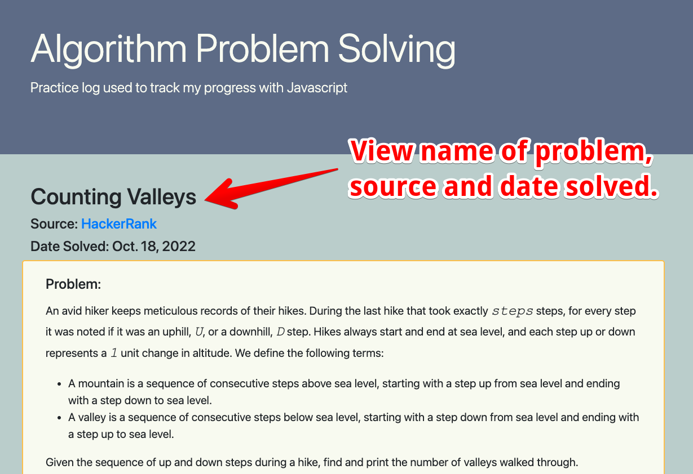
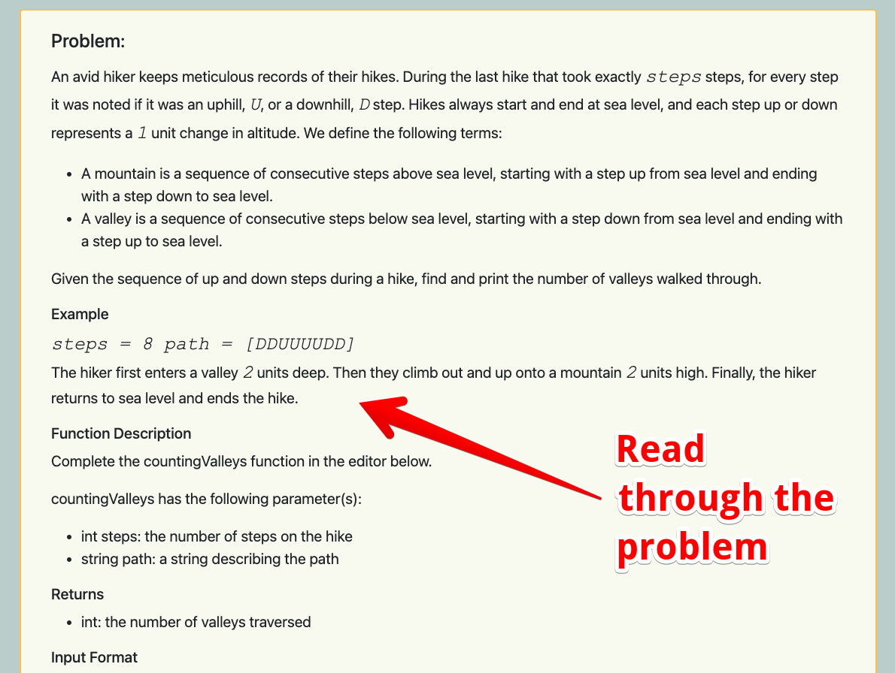
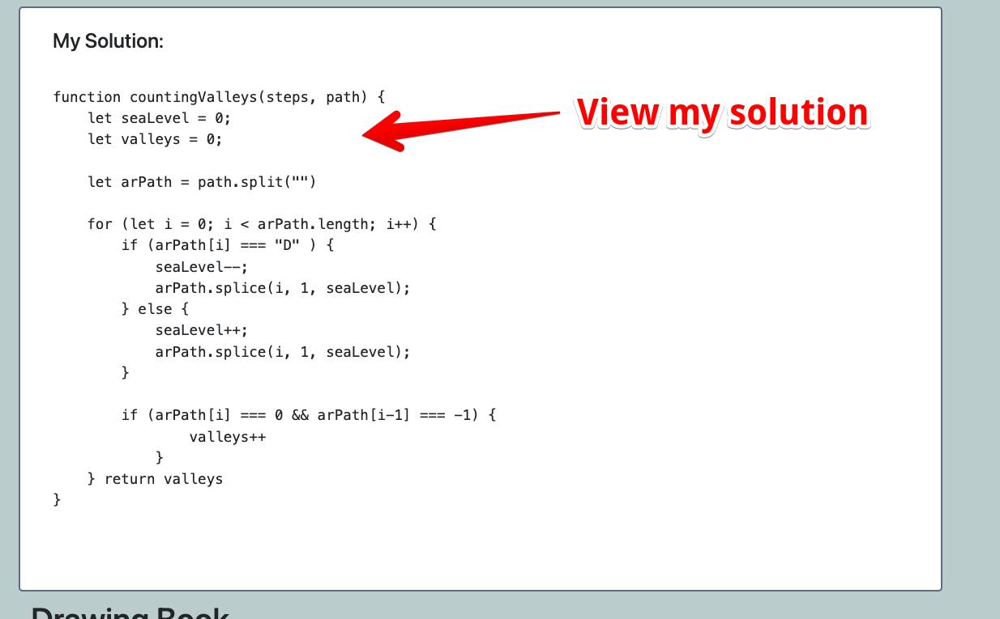
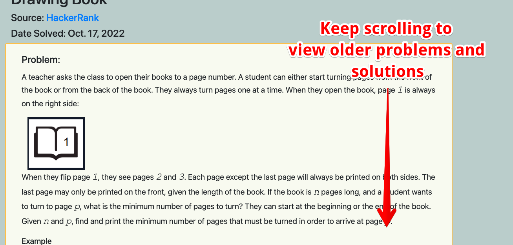

# **Algorithm Problem Solving**

## Deployed Site
Click [here.](https://chelsea314.github.io/algorithm-problem-solving/)

## Description
Welcome to my wonderful world of Algorithms! Explore my solutions and discover my approach to solving problems using JavaScript.

## Table of Contents
 - [How it Works](#how-it-works)
 - [Plans for Future Development](#plans-for-future-development)
 - [Resources](#resources)
 - [Contributing](#contributing)
 - [Questions](#questions)

## How it Works

## Plans for Future Development
For the time being, this site was built using HTML & CSS, but as I continue to grow I plan to increase its functionality by incorporating:
- Dropdown boxes to decrease problems taking up so much space
- Creating a menu and/or Table of Contents
- Options for others to submit their suggestions or soltuions
- Sections for easy, medium and difficult problems
- Psuedocode section to communicate my thinking
- As I learn more languages, include those solutions as well

## Resources

[Bootstrap](https://getbootstrap.com/) | [HackerRank](https://www.hackerrank.com/)

## Contributing
<table>

<td align="center"><a href="https://github.com/chelsea314"> <b>Chelsea Sexton</b></a></td>
<td align="center"><a href="https://github.com/missatrox44"> <b>Sara Baqla</b></a></td>
<td align="center"><a href="https://github.com/ZSerrano"> <b>Zach Serrano</b></a></td>
</tr>
</table>

## Questions
Feel free to contact me with suggestions for improvements, questions or concerns.
 

[Email: Chelsea Sexton](mailto:chelseansexton@gmail.com)